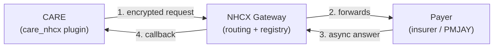
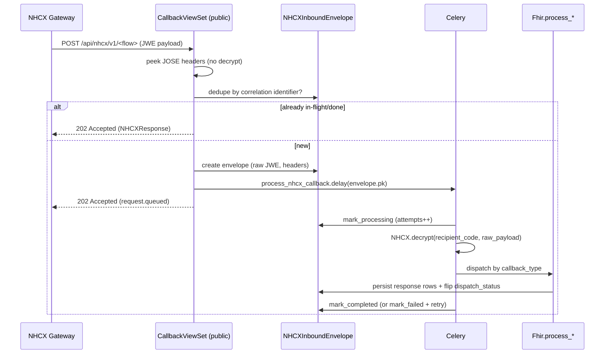
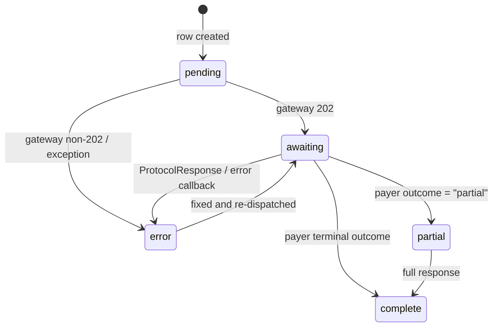
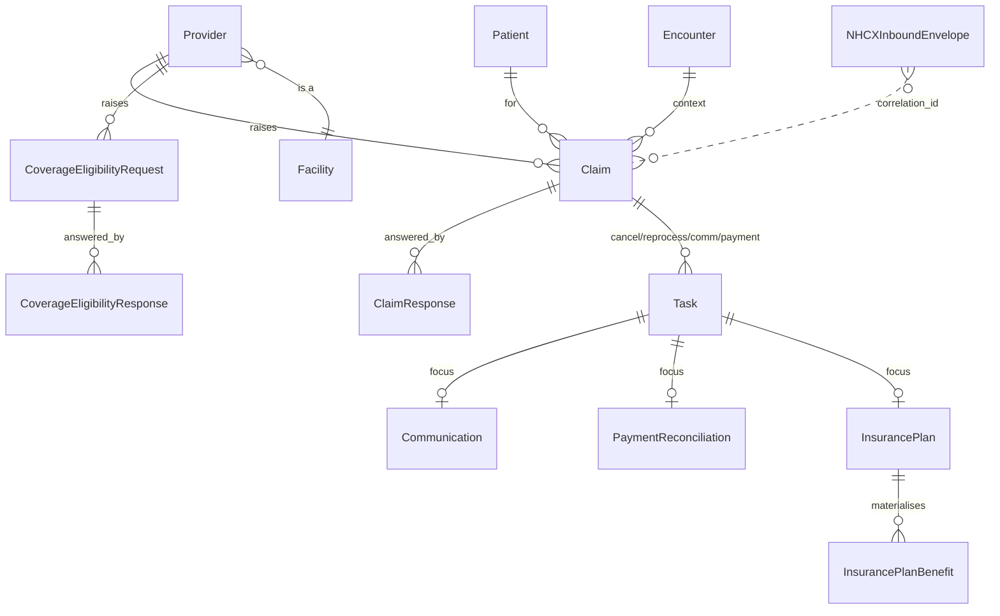
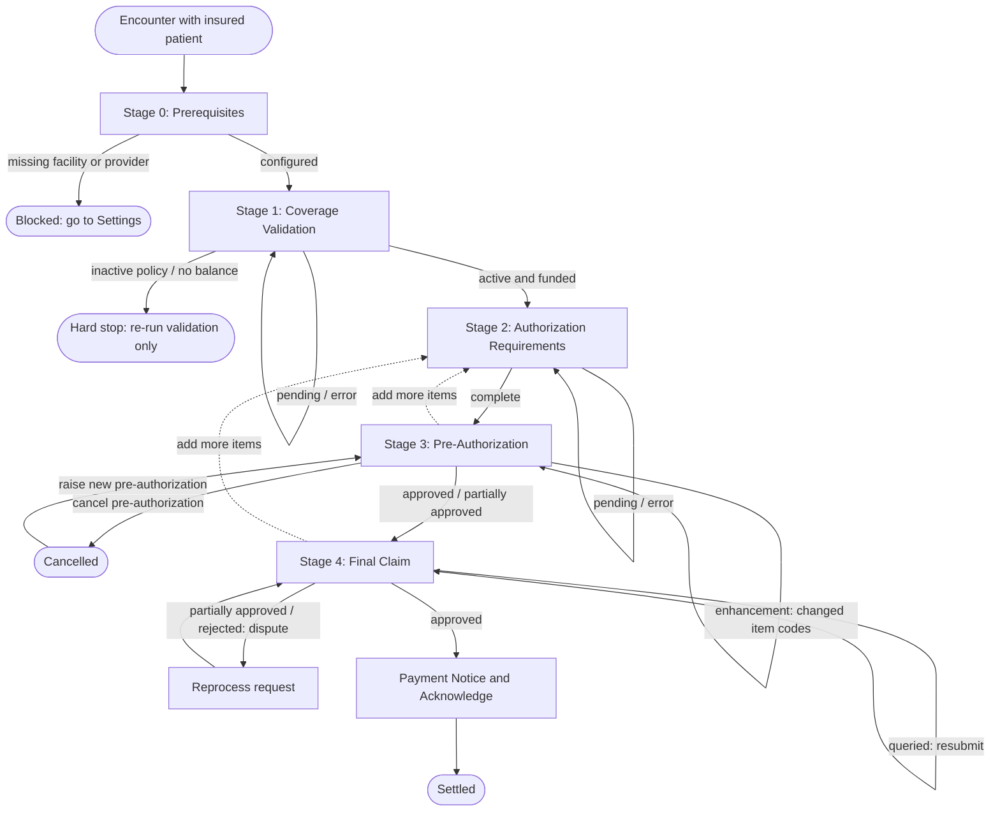

# NHCX Integration

> **Scope.** This document describes how CARE integrates with the **National Health Claims Exchange (NHCX)** through the `care_nhcx` plugin. It covers the business context, the system architecture, the technical specification of every moving part (encryption, FHIR bundles, gateway APIs, callbacks, data model and specifications), the end-to-end clinical and financial flow, and the operational concerns (deployment, onboarding, monitoring, failure handling).
>
> **Audience.** Backend engineers, integration and operations engineers, and product owners working on the digital health claims module.

---

## Table of Contents

1. [Background and Context](#1-background-and-context)
2. [Architecture](#2-architecture)
3. [Technical Specifications](#3-technical-specifications)
4. [Flows](#4-flows)
5. [Operational Aspects](#5-operational-aspects)
6. [Appendix](#6-appendix)

---

## 1. Background and Context

### 1.1 What is NHCX?

The **National Health Claims Exchange (NHCX)** is a digital gateway built under the **Ayushman Bharat Digital Mission (ABDM)** ecosystem. It standardises and routes health insurance claim transactions between the participants of the health financing system:

- **Providers**: hospitals and clinics (in our case, a CARE facility) that render care and raise claims.
- **Payers**: insurers, third party administrators, or government schemes (for example, the Pradhan Mantri Jan Arogya Yojana scheme, written here as PMJAY) that adjudicate and settle claims.
- **Beneficiaries**: patients, identified by their Ayushman Bharat Health Account number (written here as the ABHA number).

NHCX itself is a protocol and routing layer. It does not adjudicate claims. It carries **FHIR Release 4** payloads (wrapped in encrypted envelopes) between a sender and a recipient, guarantees auditability, and provides asynchronous delivery semantics. Each financial interaction (eligibility check, pre-authorization, claim, payment notice, query and communication) is a distinct FHIR exchange with a defined request and response pair.

### 1.2 The problem we are solving

Health claims in India have traditionally been paper-driven and portal-driven, insurer-specific, and non-interoperable. NHCX standardises this on:

- **FHIR Release 4** with the **NDHM / NRCES India profiles** as the wire format.
- **Asynchronous, gateway-mediated** message passing (request now, response later through a callback).
- **End-to-end encryption** using per-participant **X.509 certificates** and **JSON Web Encryption** (written here as JWE).

CARE's role in this picture is the **provider system**. The `care_nhcx` plugin makes a CARE facility a registered NHCX participant and lets clinicians and billing staff run the full claim lifecycle directly from the electronic medical record, against the patient's encounter and charge data that already lives in CARE.

### 1.3 Why a plugin?

CARE supports a [pluggable-app architecture](https://care-be-docs.ohc.network/pluggable-apps/configuration.html). NHCX is delivered as the **`care_nhcx`** plugin (a separate Django app and package) so it can be installed, versioned, and deployed independently of core CARE. It is registered in `plug_config.py`:

```python
nhcx_plugin = Plug(
    name="nhcx",
    package_name="/app/care_nhcx",   # local: /app/<folder>; prod: git+https://...
    version="",                       # empty for local editable installs
    configs={},
)
```

### 1.4 Key terminology

This integration revolves around two financial documents: the **Coverage Eligibility request** and the **Claim**. Understanding the difference between them, and the variants within each, is the foundation for everything that follows.

#### Coverage Eligibility

A **Coverage Eligibility request** is a question the provider asks the payer *before* committing to a claim. It never moves money. It is a read-only enquiry about the patient's policy. NHCX defines several purposes for this enquiry, and CARE uses two of them in the guided flow:

- **Coverage Validation** (purpose `validation`): asks "is this policy active right now, and does the patient still have wallet balance to spend?". This is the gate that decides whether the rest of the journey can even begin. If the policy is inactive or the balance is zero, the flow stops here.
- **Authorization Requirements** (purpose `auth-requirements`): asks "for the specific treatments and items I intend to bill, what supporting documents and questionnaires do you require before you will pre-authorize them?". The answer drives what the provider must attach to the upcoming pre-authorization.

Two further purposes exist in the standard and are accepted by the data model, though they are not part of the primary guided journey:

- **Benefits** (purpose `benefits`): a request for the detailed benefit breakdown of a policy.
- **Discovery** (purpose `discovery`): a request to discover which policies a patient holds.

#### Claim

A **Claim** is the financial document that actually requests money from the payer for treatment that has been or will be delivered. Unlike a Coverage Eligibility request, a Claim is binding and is adjudicated (approved, partially approved, queried, or rejected). The same Claim resource is reused for three distinct intents, distinguished by its `use` value:

- **Pre-Authorization** (`use = preauthorization`): a request for the payer to commit, in advance, to covering a planned treatment. It locks in an approved amount and yields a pre-authorization reference number that the final claim must quote.
- **Final Claim** (`use = claim`): the actual demand for settlement after (or alongside) treatment, linked back to its approved pre-authorization.
- **Pre-determination** (`use = predetermination`): a non-binding cost estimate. It looks like a claim but creates no settlement obligation.

#### How they differ

The simplest way to hold the two apart: a **Coverage Eligibility request** asks *questions* and changes nothing, while a **Claim** makes *demands* and is adjudicated. The guided journey always runs the questions first (Coverage Validation, then Authorization Requirements) and only then raises the demands (Pre-Authorization, then Final Claim).

#### Other terms

| Term | Meaning |
|------|---------|
| **Participant code** | The unique NHCX identity of a provider or payer, for example `<code>@hcx`. |
| **Correlation identifier** | The identifier that ties an outbound request to its eventual asynchronous callback. CARE uses the `external_id` (a universally unique identifier) of the originating database row. |
| **Workflow identifier** | The NHCX numeric code (`x-hcx-workflow_id`) that classifies the financial transaction type (see [section 3.6](#36-workflow-codes)). |
| **Provider** | A CARE facility that is registered as an NHCX participant (`nhcx.Provider`). |

---

## 2. Architecture

### 2.1 High-level system view

At the highest level there are three actors: the **provider** (CARE), the **NHCX gateway** (the routing and registry layer run by ABDM), and the **payer** (the insurer or scheme that decides on the claim). CARE always talks to the gateway, never to the payer directly. The gateway forwards messages to the payer and brings the payer's answers back.



**Two communication directions:**

- **Outbound (CARE to the gateway):** a synchronous HTTP `POST` of an encrypted payload. The gateway answers `202 Accepted` (queued) almost immediately. The real answer arrives later.
- **Inbound (the gateway to CARE):** the payer's answer is pushed back as a **webhook callback** to CARE's public callback URLs. CARE persists it and processes it asynchronously.

### 2.2 Plugin component map

```
care_nhcx/nhcx/
├── apps.py                  # Django AppConfig (PLUGIN_NAME = "nhcx")
├── settings.py              # Plugin settings (BACKEND_DOMAIN, PAYER, ...)
├── urls.py                  # DRF routers -> /api/nhcx/* + callback /api/nhcx/v1/*
│
├── services/                # Thin HTTP clients for external systems
│   ├── gateway.py           #   NHCX Gateway   (check / submit / on_request)
│   ├── participant.py       #   Participant registry (search/create/certs/policies)
│   └── types/               #   Pydantic request/response data objects for the above
│
├── viewsets/                # DRF viewsets = the inbound REST API surface
│   ├── coverage_eligibility.py
│   ├── claim.py             #   submit / cancel / reprocess / tasks
│   ├── communication.py     #   reply to payer queries
│   ├── payment.py           #   acknowledge payment notices
│   ├── insurance_plan.py    #   request + browse insurance plan catalogue
│   ├── member_biometric_auth.py
│   ├── gateway.py           #   policies lookup + ABHA biometric auth
│   ├── provider.py          #   facility <-> NHCX participant registration
│   └── callback.py          #   PUBLIC inbound webhooks (no auth)
│
├── models/                  # Persistence
│   ├── provider.py          #   Provider (participant code + private key + facility)
│   ├── coverage_eligibility.py
│   ├── claim.py             #   Claim + ClaimResponse
│   ├── task.py              #   Task (cancel/reprocess/communication/payment/plan)
│   ├── communication.py / payment.py
│   ├── insurance_plan.py    #   Full FHIR InsurancePlan relational tree
│   ├── member_biometric_auth.py
│   ├── inbound_envelope.py  #   NHCXInboundEnvelope (callback inbox)
│   └── __init__.py          #   DispatchStatusChoices
│
├── tasks/
│   └── process_callback.py  # Celery worker: decrypt + dispatch to Fhir handler
│
├── utils/
│   ├── nhcx.py              #   JWE encrypt/decrypt + header prep
│   ├── crypt.py             #   X.509 self-signed cert generation
│   ├── fhir.py              #   FHIR bundle builders + inbound processors
│   ├── insurance_plan_ingestor.py  # Bulk ingest of large insurance plan bundles
│   ├── dispatch.py          #   Outbound lifecycle stamping helper
│   ├── workflow_codes.py    #   Derive NHCX workflow_id from claim chain state
│   └── exceptions.py        #   NHCXAPIException / NHCXInternalException
│
└── specs/                   # Pydantic specifications (create/list/retrieve) + valuesets
```

### 2.3 Layered responsibilities

| Layer | Responsibility |
|-------|----------------|
| **Specifications** (`specs/`) | Validate inbound API request bodies, serialize outbound API responses, bind coded fields to FHIR valuesets. |
| **Viewsets** (`viewsets/`) | REST endpoints. Build the FHIR bundle, encrypt, dispatch to the gateway, persist domain rows. |
| **FHIR utility** (`utils/fhir.py`) | Translate CARE and NHCX models to and from FHIR Release 4 NDHM bundles (both directions). |
| **NHCX utility** (`utils/nhcx.py`) | JWE encryption and decryption, plus `x-hcx-*` header assembly. |
| **Services** (`services/`) | Pure HTTP transport to the gateway and the participant registry. |
| **Tasks** (`tasks/`) | Off-the-hot-path callback processing with retries. |
| **Models** (`models/`) | Persisted domain state plus dispatch and envelope tracking. |

### 2.4 The asynchronous callback pipeline

This is the architectural backbone of the inbound path and deserves special attention. NHCX callbacks can be large (a single PMJAY insurance plan decrypts to between 50 and 100 megabytes), so CARE never processes them inside the webhook request.



This buys us:

- **The gateway never times out**, even on very large ingests.
- **Idempotency**: a re-delivered correlation identifier short-circuits at the view layer (`_DEDUPE_STATUSES`).
- **A replayable audit trail**: every raw envelope is stored losslessly and failed ones can be re-run.
- **Retry and backoff**: `process_nhcx_callback` uses `autoretry_for=(Exception,)` with exponential backoff (`max_retries=3`).

### 2.5 Security architecture

- **Transport:** every payload between CARE and a payer is a **JWE compact-serialized token** (`RSA-OAEP-256` key wrapping plus `A256GCM` content encryption).
- **Keys:** when a facility is registered as a provider, CARE generates an **RSA 2048-bit keypair** and a **self-signed X.509 certificate**. The certificate is uploaded to the NHCX participant registry. The private key is stored on the `Provider` row and used to decrypt inbound payloads.
- **Recipient keys:** to encrypt an outbound message, CARE fetches the **recipient's encryption certificate** from the participant registry (`/fetch/certs`) at send time.
- **Callbacks are unauthenticated** (`permission_classes = []`, `authentication_classes = []`). Trust is established by the ability to **decrypt** the JWE with the provider's private key, not by an authentication token. A payload that cannot be decrypted is failed and recorded.

---

## 3. Technical Specifications

### 3.1 External systems

| System | Base URL (sandbox) | Used for |
|--------|--------------------|----------|
| **NHCX Gateway** | `https://apisbx.abdm.gov.in/hcx` | All financial transactions plus ABHA biometric authentication |
| **Participant Registry** | `https://apisbx.abdm.gov.in/pmjay/sbxhcx/participanthcxservice` | Participant search, create, and update; certificate fetch; policy lookup |

Both clients reuse the **ABDM `Request`** helper (`abdm.service.request.Request`) for bearer-token acquisition (`auth_header()`), so the NHCX plugin depends on the `care_abdm` plugin being installed.

### 3.2 Inbound REST API (provider-facing)

All routes are mounted under **`/api/nhcx/`**. The principal endpoints:

| Resource | Method and path | Purpose |
|----------|-----------------|---------|
| Provider | `POST/PUT/GET /provider/` | Register or update a facility as an NHCX participant |
| Gateway | `POST /gateway/get_policies/` | Look up a beneficiary's policies |
| Gateway | `POST /gateway/abha-biometric-auth-init/` and `.../verify/` | ABHA biometric (fingerprint, iris, face) member authentication |
| Coverage Eligibility | `POST /coverage-eligibility-request/` | Create a Coverage Eligibility request (validation or authorization requirements) |
| Coverage Eligibility | `POST /coverage-eligibility-request/{id}/check/` | Encrypt and dispatch the request to the payer |
| Coverage Eligibility | `GET /coverage-eligibility-request/latest/` | Latest Coverage Eligibility request for an encounter or patient |
| Claim | `POST /claim/` | Create a claim (pre-authorization, final claim, or pre-determination) |
| Claim | `POST /claim/{id}/submit/` | Encrypt and dispatch to the gateway (routes by `use`) |
| Claim | `POST /claim/{id}/cancel/` | Raise a cancel Task (pre-authorization only) |
| Claim | `POST /claim/{id}/reprocess/` | Raise a reprocess Task (final claim only) |
| Claim | `GET /claim/{id}/tasks/` | List tasks attached to a claim |
| Communication | `POST /communication/{id}/send/` | Reply to a payer query |
| Payment | `POST /payment/{id}/acknowledge/` | Acknowledge a payment notice |
| Insurance Plan | `POST /insurance-plan/request/` | Request a payer's plan catalogue |
| Insurance Plan | `GET /insurance-plan/`, `/insurance-plan-benefit/`, `.../lookup/` | Browse and search ingested plans and priced benefits |

### 3.3 Inbound callback API (NHCX-facing, public)

Mounted under **`/api/nhcx/v1/`** (no trailing slash, no authentication). One endpoint per NHCX flow:

| Callback path | `CallbackTypeChoices` | Handler |
|---------------|------------------------|---------|
| `coverageeligibility/on_check` | `COVERAGE_ELIGIBILITY_ON_CHECK` | `process_coverage_eligibility_check_response` |
| `predetermination/on_submit` | `PREDETERMINATION_ON_SUBMIT` | `process_claim_response` |
| `preauth/on_submit` | `PREAUTH_ON_SUBMIT` | `process_claim_response` |
| `claim/on_submit` | `CLAIM_ON_SUBMIT` | `process_claim_response` |
| `communication/request` | `COMMUNICATION_REQUEST` | `process_communication_request` |
| `paymentnotice/request` | `PAYMENT_NOTICE_REQUEST` | `process_payment_notice_request` |
| `insuranceplan/on_request` | `INSURANCE_PLAN_ON_REQUEST` | `process_insurance_plan_response` |
| `task/on_submit` | `TASK_ON_SUBMIT` | `process_task_response` |
| `error/response` | `ERROR_RESPONSE` | `_record_error_callback` |

**Three message shapes** arrive on these URLs:

1. **JWE payload** (`{"payload": "<jwe>"}`): a normal asynchronous response, enqueued for processing.
2. **`type=ProtocolResponse`** (headers as top-level `x-hcx-*` keys, no payload): an acknowledgement or error from the gateway. If `x-hcx-status == "response.error"`, the originating row is marked **failed** (`_attach_error_to_anchor`).
3. **Plain error JSON** on `/error/response`: recorded as a completed envelope, with the anchor row flagged.

The provider's endpoint URL registered with NHCX is `BACKEND_DOMAIN + "/api/nhcx"` (set in `provider.py`).

### 3.4 JWE encryption and `x-hcx-*` headers

Encryption is centralised in `utils/nhcx.py`.

**Outbound (`NHCX.encrypt`)**:
1. Fetch the recipient's encryption certificate from the participant registry.
2. Build the protected JOSE header (`prepare_headers`).
3. Encrypt the FHIR JSON with `RSA-OAEP-256` plus `A256GCM`.

**Mandatory header parameters** (validated): `sender_code`, `recipient_code`, `patient_abha_number`, `correlation_id`.

The full protected header set:

| Header | Source or default |
|--------|-------------------|
| `alg` / `enc` | `RSA-OAEP-256` / `A256GCM` |
| `x-hcx-timestamp` | now (ISO, local time zone) |
| `x-hcx-sender_code` | provider participant code |
| `x-hcx-recipient_code` | payer participant code |
| `x-hcx-ben-abha-id` | patient ABHA number |
| `x-hcx-correlation_id` | **`external_id` of the originating row** (Coverage Eligibility request, Claim, or Task) |
| `x-hcx-request_id` / `x-hcx-api_call_id` | `uuid4()` if not supplied |
| `x-hcx-workflow_id` | derived workflow code (or `"1"`) |
| `x-hcx-status` | `request.initiated` / `response.complete` / ... |
| `x-hcx-debug_flag` | `ERROR` |
| `x-hcx-error_details` / `x-hcx-debug_details` | optional |

**Inbound (`NHCX.decrypt`)**: looks up the `Provider` by `recipient_code` (with or without `@hcx`), loads its private key, and decrypts the JWE. `NHCX.headers(data)` peeks the JOSE header **without decrypting**. This is how the callback view dedupes and routes before doing any heavy work.

### 3.5 FHIR bundle construction

The `Fhir` class (`utils/fhir.py`) translates between CARE and NHCX models and **FHIR Release 4 NDHM-profiled bundles**. Outbound bundle builders:

| Builder | Bundle profile | Anchor resource |
|---------|----------------|-----------------|
| `create_coverage_eligibility_request_bundle` | `CoverageEligibilityRequestBundle` | `CoverageEligibilityRequest` |
| `create_claim_bundle` | `ClaimBundle` | `Claim` |
| `create_task_bundle` | `TaskBundle` | `Task` |

Each bundle is a `collection` whose first entry is the anchor resource and the rest are **profile entries** accumulated in a per-instance cache (`cached_profiles()`): Patient, Practitioner, Organization, Location, Coverage, Condition, DocumentReference, QuestionnaireResponse, and so on. A `@cache_profiles` decorator keys each referenced resource by `<ResourceType>/<external_id>` so the same Patient or Organization is never emitted twice and `urn:uuid:` references resolve cleanly.

All timestamps are normalised to **India Standard Time (`Asia/Kolkata`)** through `_to_ist`.

> **Debug note:** the viewsets currently also write the generated bundle to a local JSON file (for example, `claim_submit.json`, `coverage_eligibility_request_check.json`) on each dispatch. This is a debugging aid; see [section 5.7](#57-known-rough-edges-and-cleanup-targets).

**Inbound processors** parse the response bundle using `Bundle.construct(...)` (no strict FHIR validation, to tolerate payer quirks), pull the relevant resource by `resourceType`, dereference internal references through a `fullUrl` to resource index (`_build_bundle_index` / `_resolve_ref`), and persist the corresponding `*Response` rows.

### 3.6 Workflow codes

NHCX classifies each financial transaction by an `x-hcx-workflow_id`. CARE does **not** store an explicit transaction type. It **derives** the code from the claim's position in the related-claim chain and the latest adjudication status (`utils/workflow_codes.py`):

| Code | Meaning | When |
|------|---------|------|
| `12` | PREAUTH_REQUEST_INITIATED | New pre-authorization (no related claim) |
| `121` | PREAUTH_REQUEST_RESUBMITTED | Resubmit a pre-authorization after rejection, or against an approved pre-authorization where only amounts, stratification, or implants changed (no item-code change) |
| `122` | PREAUTH_CANCEL_INITIATED | Cancel an approved pre-authorization |
| `19` | PREAUTH_QUERY_RESPONSE_SUBMITTED | Reply to a pre-authorization query (no item-code change in the chain) |
| `13` | ENHANCEMENT_REQUEST_INITIATED | Enhancement on an approved pre-authorization: the line-item product or service codes changed (a code was added, removed, or swapped) |
| `131` | ENHANCEMENT_QUERY_RESPONSE_SUBMITTED | Reply to a query on an enhancement (an item-code change exists somewhere up the chain) |
| `15` | CLAIM_REQUEST_INITIATED | Final claim (parent is a pre-authorization) |
| `16` | CLAIM_REQUEST_RESUBMITTED | Resubmit a rejected claim, or resubmit an approved claim where only amounts, stratification, or implants changed |
| `151` | CLAIM_QUERY_RESPONSE_SUBMITTED | Reply to a claim query |
| `17` | PAYMENT_RECEIVED | Acknowledge a payment notice |
| `18` | REPROCESS_REQUEST_SUBMITTED | Raise a reprocess request on an approved final claim |

The resolver walks `claim.related[0].claim` back up the chain (bounded by `CHAIN_WALK_LIMIT = 32`) to distinguish, for example, a plain pre-authorization query (`19`) from an enhancement query (`131`). Illegal transitions raise `ValidationError` (for example, submitting a final claim with no linked pre-authorization, or re-submitting an already-approved claim whose items changed).

#### Enhancement versus resubmission (the key distinction)

When a new pre-authorization or claim is sent against a related claim that was **approved or partially approved**, the system has to decide whether it is an **enhancement** or a plain **resubmission**. The rule is based entirely on the **line-item product or service codes** (`item[].product_or_service`):

- It is an **enhancement** (`13` for pre-authorization, or a reprocess for a final claim) when the set of item codes **changed**, that is a code was **added, removed, or swapped** compared to the related claim. An enhancement asks the payer to cover a different or expanded set of treatments.
- It is a **resubmission** (`121` / `16`) when the item codes are **unchanged** and only other attributes differ, specifically the **amount** (quantity, unit price, or factor), the **stratification** (`program_code`), or the **implant** (`modifier`). These are corrections to an already-agreed set of items, not new treatments.

A worked example of why the chain walk matters: an enhancement can itself be queried, and the query reply shares the same items as the enhancement, so diffing only the immediate parent would miss it. For a queried related claim the resolver walks back up `related[0].claim` to the first approved or partially approved ancestor and diffs the item codes there, which is how it tells `PREAUTH_QUERY_RESPONSE_SUBMITTED` (`19`) apart from `ENHANCEMENT_QUERY_RESPONSE_SUBMITTED` (`131`).

There is one asymmetry between the two `use` types. An **approved final claim whose item codes changed cannot be resubmitted** through the claim submit endpoint at all: that is an enhancement of a settled claim, which must instead be raised as a separate **reprocess** request (`18`). Submitting it as a claim raises a `ValidationError`. An approved pre-authorization, by contrast, accepts an enhancement (`13`) directly.

### 3.7 Dispatch lifecycle (outbound state machine)

Every outbound request (Claim, Coverage Eligibility request, or Task) carries three tracking columns, stamped in one place by `utils/dispatch.py::dispatch(...)`:

- `dispatched_at`: when we last handed it to the gateway.
- `dispatch_error`: last error text (`""` means none).
- `dispatch_status`: machine-readable lifecycle state.



| State | Meaning |
|-------|---------|
| `pending` | Created, never sent |
| `awaiting` | Gateway accepted (202); waiting for the payer callback (also the resting state for `"queued"` outcomes) |
| `partial` | Payer returned a partial FHIR outcome; a fuller response is still expected |
| `complete` | Terminal payer answer received (approved, rejected, and so on) |
| `error` | Failed at any stage: immediate gateway error, `ProtocolResponse` with `response.error`, or `/error/response` |

The asynchronous transitions (`partial` and `complete`) are applied by the `Fhir.process_*` handlers based on the FHIR `outcome` (`"queued"` leaves the state untouched). `error` is applied by `_attach_error_to_anchor`, which also stores a structured `meta["last_error"]` block and sets `status = "failed"` so the user interface can show a retry banner.

### 3.8 Insurance plan ingestion and model design

An insurance plan is the payer's **catalogue**: the full list of coverages, benefits, packages, prices, exclusions, conditions, and required documentation for a policy product. Unlike claims and coverage eligibility records (which belong to a single patient encounter), a catalogue belongs to the **facility** and is shared across every patient treated under that payer. It is fetched once and then reused for item prefill and benefit lookups throughout the flow.

#### How a catalogue is requested and received

A catalogue is requested through `POST /insurance-plan/request/`, which creates a `Task` (use case `insurance_plan_request`) carrying the policy number and the provider's health facility registry identifier, encrypts it, and dispatches it to the gateway. The payer answers asynchronously on the `insuranceplan/on_request` callback.

These bundles are very large: a single PMJAY catalogue expands to roughly **25,000 to 30,000 rows** and between 50 and 100 megabytes when decrypted. Because of this, `process_insurance_plan_response` bypasses the usual pydantic specification path and hands the raw dictionary to `InsurancePlanIngestor`, which writes every level of the FHIR tree using `bulk_create` inside a **single database transaction**. The whole ingest completes in a few seconds rather than issuing tens of thousands of individual inserts.

#### How the catalogue is stored

The relational model in `nhcx/models/insurance_plan.py` mirrors the FHIR `InsurancePlan` resource as a tree, one Django model per FHIR level:

- **`InsurancePlan`**: the root. Holds identifiers, status, type, name, validity period, and the owning and administering organizations (kept as full FHIR Organization payloads for display).
- **`InsurancePlanCoverage`**: a broad coverage category (for example, inpatient, outpatient, or emergency).
- **`InsurancePlanCoverageBenefit`** and **`InsurancePlanCoverageBenefitLimit`**: the clinical benefits within a coverage and any quantitative limits on them. This is the **catalogue** side: what is covered.
- **`InsurancePlanPlan`** and **`InsurancePlanPlanGeneralCost`**: a coverage paired with a cost-sharing structure, plus the overall sum insured.
- **`InsurancePlanPlanSpecificCost`**, **`InsurancePlanPlanSpecificCostBenefit`**, **`InsurancePlanPlanSpecificCostBenefitCost`**, and **`InsurancePlanPlanSpecificCostBenefitCostQualifier`**: the specialty bucket, the package or procedure within it, its price, and add-on qualifiers (stratification, implant, investigation, medicine). This is the **pricing** side: what it costs.

To make filtering fast, several models flatten their first FHIR coding into an indexed `*_code` (and sometimes `*_display`) column inside `save()`, so queries never have to dig into JSON.

#### Capturing NDHM claim extensions

NDHM bundles attach three FHIR claim extensions (`Claim-Exclusion`, `Claim-Condition`, `Claim-SupportingInfoRequirement`) at *any* level of the tree. Rather than duplicate these columns on every model, they are stored in three dedicated tables that share an abstract base (`ClaimExtensionBase`) and attach to their parent through a polymorphic generic foreign key. The base derives a `level` value (insurance plan, coverage, coverage benefit, plan, or specific-cost benefit) from the parent type so a single extension table can be filtered by where it attached.

- **`ClaimExclusion`**: excluded coverage details.
- **`ClaimCondition`**: conditions to satisfy for benefit eligibility. PMJAY sends one block per benefit carrying roughly fifteen named sub-properties (for example, `ProcedureType`, `ApprovalNotRequired`, `ImplantApplicable`, `IsDayCare`). The full property bag is preserved in `properties` for a lossless round-trip, and the most frequently queried flags are mirrored into typed, indexed columns by `_populate_from_properties()`.
- **`ClaimSupportingInfoRequirement`**: the documentation a payer requires, joined to questionnaires through `documentation_url`.

Bundled FHIR questionnaires (standard treatment guidelines, history forms, and so on) are stored as **`InsurancePlanQuestionnaire`** rows, which drive the documentation requirements surfaced during the authorization requirements and claim stages.

#### The denormalised benefit table

The tree above is faithful but expensive to query: answering "for this charge item, what is the price, is authorization required, and what documents are needed?" would mean joining the catalogue side to the pricing side and rolling up extensions on every request. To avoid this, the ingestor runs a final **fusion pass** that materialises **`InsurancePlanBenefit`**: one row per `(insurance_plan, plan, coverage_type_code, type_code)` tuple. Each row fuses the catalogue `CoverageBenefit` with the priced `SpecificCostBenefit` and pre-computes the answers the flow needs:

- prices (`min_cost`, `max_cost`, `max_limit_amount`),
- boolean flags (`authorization_required`, `is_day_care`, `implant_applicable`, `has_copayment`, `has_deductible`, `has_waiting_period`, and the various qualifier flags), with the merge rule "the priced benefit wins on a non-null value, otherwise the catalogue benefit, otherwise the default",
- documentation hints (`has_questionnaire`, `questionnaire_fhir_ids`, `requires_supporting_info`, and the supporting-info, condition, and exclusion counts).

The source rows remain reachable through `coverage`, `specific_cost_benefit`, and the FHIR identifier lists for detail views. The list, search, filter, and `lookup` endpoints all read this single indexed table.

### 3.9 Member biometric authentication

Some PMJAY flows require the beneficiary to authenticate biometrically (fingerprint, iris, or face) before a pre-authorization or claim is accepted. `GatewayService.abha__biometric__auth__init/verify/refresh` wrap the ABHA biometric APIs. On success a `MemberBiometricAuth` row (token and refresh token, scoped to `encounter` plus `payer_id`) is stored and its `token` is sent as the `X-User-Token` header on the subsequent pre-authorization or claim submission.

### 3.10 Configuration and settings

Plugin settings (`nhcx/settings.py`, resolved from `PLUGIN_CONFIGS["nhcx"]` then environment variables):

| Setting | Default | Notes |
|---------|---------|-------|
| `BACKEND_DOMAIN` | `https://careapi.ohc.network` | **Required.** Used to build the callback endpoint URL registered with NHCX. |
| `PAYER` | `PMJAY` | `PMJAY` or `DUMMY`; switches some insurance-plan request defaults. |

### 3.11 Data model and specifications

This section walks through how each domain object is **stored** (its Django model) and how it is **shaped at the API boundary** (its pydantic specification). Two facts about where records live anchor the whole design:

- **Claims and coverage eligibility records are stored at the encounter level.** When a patient is admitted, an encounter is created for them, and every Coverage Eligibility request and Claim raised during that admission hangs off that encounter.
- **Insurance plans are stored at the facility level.** A catalogue is shared across all of a facility's patients and is not tied to any one encounter.

#### Specification design (shared pattern)

The plugin follows the core CARE pydantic specification pattern, with three variants per resource:

- a **Create** specification that validates the inbound request body (checking referenced patients, encounters, charge items, conditions, and file uploads actually exist, enforcing unique sequence numbers, and resolving the insurer through the participant registry),
- a **List** specification that serializes a row for collection views (flattening foreign keys to their `external_id` and attaching the latest response), and
- a **Retrieve** specification that extends the list shape with fully expanded nested objects (for example, serialized charge items and diagnoses).

Coded fields are bound to FHIR valuesets through `ValueSetBoundCoding`, so values like diagnosis codes are validated against an allowed set at the boundary. The specifications under `specs/valuesets/` hold those allowed sets.

The dispatch tracking trio (`dispatched_at`, `dispatch_error`, `dispatch_status`) described in [section 3.7](#37-dispatch-lifecycle-outbound-state-machine) appears on every model that CARE dispatches to the gateway, namely `CoverageEligibilityRequest`, `Claim`, and `Task`. It is not repeated in the field lists below.

#### Provider

`Provider` is the facility's NHCX identity, and the only NHCX record scoped purely to a facility rather than an encounter. Unlike most models it extends the lighter `BaseModel` (not the electronic medical record base), because it is infrastructure rather than clinical data.

| Field | Purpose and quirks |
|-------|--------------------|
| `participant_code` | The facility's NHCX participant identity, for example `<code>@hcx`. Unique, but nullable because the row is created locally before the registry call returns it. |
| `encryption_private_key` | The PEM-encoded RSA private key generated at onboarding. Held server-side and used to decrypt every inbound callback. Quirk: secret material lives directly on the row, so the table should be access-controlled. |
| `facility` | A one-to-one link to `facility.Facility` (`on_delete=PROTECT`), so a facility cannot be deleted while it is a registered provider. |

#### CoverageEligibilityRequest

The outbound enquiry. Most of the FHIR detail is held as JSON rather than relational columns, because the shapes are validated by the pydantic specification and only ever round-tripped into a FHIR bundle.

| Field | Purpose and quirks |
|-------|--------------------|
| `status`, `priority` | FHIR request status (for example `active`) and priority (for example `normal`). |
| `purpose` | A JSON list holding `validation` or `auth-requirements`. It is a list because FHIR allows several purposes on one request, though the guided flow sends one at a time. |
| `provider`, `patient` | Foreign keys to the raising provider and the patient. Both required. |
| `encounter` | Foreign key to the encounter. Nullable in the schema, but the guided flow always sets it, which is what anchors the record to the admission. |
| `insurer` | The payer, resolved from the participant registry and stored as a JSON snapshot. Quirk: it is currently resolved from a hard-coded test participant code pending a real lookup. |
| `insurance` | The chosen policy or policies as JSON. This is the section the user edits during validation and is read-only thereafter. |
| `supporting_info` | JSON list of documents or free-text notes, each with a `sequence` that items can reference. |
| `item` | JSON list of the treatments or charge items being asked about, each with its own `sequence`. |

#### CoverageEligibilityResponse

The payer's answer to a `CoverageEligibilityRequest` (`request` foreign key).

| Field | Purpose and quirks |
|-------|--------------------|
| `outcome` | The FHIR outcome (`complete`, `queued`, `error`, and so on). |
| `disposition` | Optional human-readable summary from the payer. |
| `insurance` | A dereferenced list of insurance entries, not the raw bundle: each entry carries the policy status (`inforce`), the wallet `balance` (allowed versus used), and per-item allowed amounts, authorization requirements, required documents, and required questionnaires. Quirk: the original FHIR bundle is preserved separately under `meta["raw_response"]` so nothing is lost. |
| `error` | JSON error detail when the outcome is an error. |

#### Claim

The single model reused for pre-authorization, final claim, and pre-determination, distinguished by `use`. As with `CoverageEligibilityRequest`, the FHIR-heavy parts are JSON.

| Field | Purpose and quirks |
|-------|--------------------|
| `use` | `preauthorization`, `claim`, or `predetermination`. This drives both the submit routing and the workflow code. |
| `status`, `priority` | FHIR claim status and priority. `status` is also flipped locally to `cancelled` when a cancel task is approved. |
| `type` | The claim type (inpatient, outpatient, emergency, and so on) as JSON, auto-set from the encounter class. |
| `provider`, `patient`, `encounter` | Foreign keys. `encounter` is nullable in the schema but always set by the flow. |
| `insurer`, `insurance` | The resolved payer snapshot and the policy, as JSON. |
| `related` | The chain link. A JSON list whose first entry points (by `external_id`) at the parent claim. This is what ties a final claim back to its pre-authorization, and an enhancement or resubmission back to its predecessor. The workflow resolver walks this chain. |
| `billable_period`, `care_team`, `supporting_info`, `procedure`, `diagnosis`, `item`, `accident`, `payee` | The FHIR claim body, all JSON. `diagnosis` and `item` are required (default to a list). |
| `questionnaire_responses` | JSON answers to the questionnaires the payer required. |

#### ClaimResponse

The payer's adjudication of a `Claim` (`request` foreign key).

| Field | Purpose and quirks |
|-------|--------------------|
| `use`, `status` | Echoed from the claim. |
| `outcome` | The FHIR outcome. Quirk: this is the FHIR-level enum, distinct from the business adjudication status below. |
| `pre_auth_ref` | The payer-assigned pre-authorization reference number. Present only on pre-authorization approvals, and required when the subsequent final claim is submitted. |
| `adjudication` | The machine-readable business status (`approved`, `partially_approved`, `queried`, `rejected`) as JSON. The workflow resolver reads this, not `outcome`, to decide the next transition. Quirk: the status is nested inside a coding whose category code is `status`, and hyphenated values like `partially-approved` are normalised to underscores. |
| `identifier` | The payer's own identifier(s) for the response, for example a claim number. |
| `type`, `item`, `add_item`, `total`, `error` | Adjudication detail: response type, per-item decisions, payer-added items, totals, and any error block. |

#### Task

`Task` is the generic NHCX work item used for everything that is not a `CoverageEligibilityRequest` or a `Claim`. The cancel, reprocess, communication, payment, and insurance-plan flows are all built on it.

| Field | Purpose and quirks |
|-------|--------------------|
| `use_case` | A `TaskUseCaseChoices` value that says which flow this task belongs to (cancel, reprocess, communication, payment, search, or insurance-plan, each in a request and a response variant). This is how one table serves many flows. |
| `status`, `intent`, `priority`, `code`, `reason_code` | FHIR task fields. `reason_code` carries the NDHM-coded cancel or dispute reason. |
| `input`, `output` | JSON parameter lists, for example the claim number and pre-authorization reference on a cancel, or the policy number and provider identifier on an insurance-plan request. |
| `part_of` | Self-foreign key, linking a response task to its request task. |
| `claim` | Optional foreign key to the claim this task acts on. |
| `focus` | A generic foreign key (`focus_type` + `focus_id`) pointing at the focused resource, so a task can target any model without a dedicated column. |
| `authored_on`, `description`, `identifier` | Metadata. |

#### CommunicationRequest and Communication

These two model the payer-query conversation. They are not tasks themselves, but each is driven by a `Task` (the `based_on` / `part_of` link), mirroring the request-and-response shape `Task` uses elsewhere.

- **`CommunicationRequest`**: the payer's query. Links to the driving `Task` (`based_on`), the `Claim` it concerns (`about`), an optional `CommunicationRequest` it `replaces`, and carries the query `payload`, `category`, and `status`.
- **`Communication`**: the provider's reply. Links to the originating `CommunicationRequest` (`based_on`), the `Claim` (`about`), and optionally the `Task` (`part_of`), and carries the reply `payload` and the `sent` timestamp.

#### PaymentReconciliation

A payment notice from the payer. Like the communication models, it is created in response to a `Task` (the `request` foreign key) rather than being a task itself.

| Field | Purpose and quirks |
|-------|--------------------|
| `payment_amount` | The settled amount as a JSON money object. Required. |
| `payment_date` | When the payment was made. Required. |
| `outcome`, `disposition`, `period`, `detail`, `process_note` | Settlement detail. |
| `request`, `claim` | Foreign keys to the driving task and the claim being settled. |

#### Insurance plan tree

The relational tree (`InsurancePlan` and its descendants, the polymorphic claim-extension tables, the bundled questionnaires, and the denormalised `InsurancePlanBenefit`) is described field-by-field in [section 3.8](#38-insurance-plan-ingestion-and-model-design). Its root links back to the requesting `Task`.

#### NHCXInboundEnvelope

The durable callback inbox, central to the asynchronous pipeline in [section 2.4](#24-the-asynchronous-callback-pipeline).

| Field | Purpose and quirks |
|-------|--------------------|
| `raw_payload` | The verbatim NHCX body, kept lossless. Usually a JWE string, but sometimes plain JSON (on `error/response`). |
| `headers` | The JOSE headers peeked without decrypting, used for routing and dedupe. |
| `callback_type` | Which webhook URL delivered it (a `CallbackTypeChoices` value). |
| `correlation_id`, `api_call_id` | The identifiers used to match the envelope back to its originating row and request. |
| `recipient_code` | The participant the payload was addressed to, used to pick the decryption key. |
| `status`, `attempts`, `error_message`, `processed_at` | Processing state. Quirk: `failed` envelopes are intentionally never deduped, so operators can fix and replay them; the `mark_processing` / `mark_completed` / `mark_failed` helpers drive these transitions. |

#### MemberBiometricAuth

The biometric token issued for a `(encounter, payer_id)` pair. `encounter` is a one-to-one link, so an encounter holds at most one biometric authorization at a time. It stores the `token` and `refresh_token` (with their `expires_in` / `refresh_expires_in` lifetimes) and the `accounts` returned by the ABHA biometric API. The `token` is attached as `X-User-Token` on the next pre-authorization or claim submission.

#### Entity relationships



---

## 4. Flows

> This section describes the intended **provider-facing journey** as a sequence of stages, the branches at each stage, and the actions a provider can take. The backend endpoints in [section 3](#3-technical-specifications) are what actually enforce it. Where it helps, the backend mechanics behind a stage are called out separately.

### 4.1 Where records live

Everything in the journey is anchored to a single patient **encounter**. When a patient is admitted, an encounter is created, and every Coverage Eligibility request and Claim raised for that admission belongs to it. The **insurance plan** catalogue is the exception: it is stored at the **facility** level and shared across all patients treated under that payer.

### 4.2 Overview: a guided, timeline-driven journey

The journey is presented as a single guided experience titled "Insurance Claim Flow". Rather than a static form, it renders a **timeline of activity**: every Coverage Eligibility request and Claim appears as a card, newest first. Only the **most recent card** offers actionable next steps. Older cards are read-only history.

The guiding principle is that the provider is never asked to choose freely what to do next. At each point the most recent card surfaces a single, context-aware primary action (with a small set of secondary actions where appropriate), so the provider is funnelled down the correct path. The journey is sequential and strict: Coverage Validation, then Authorization Requirements, then Pre-Authorization, then Final Claim, then Payment.



A few things the diagram makes explicit:

- **Add more items loops back to Authorization Requirements.** It is offered as a secondary action from the Authorization Requirements, Pre-Authorization, and (where applicable) later cards, and always routes back to raise a fresh Authorization Requirements request before continuing. It is not a one-time step.
- **Pre-authorization has its own loop.** A rejected pre-authorization is resubmitted, a queried one is answered and resubmitted, and an approved one can be enhanced (when the line-item codes change) before moving on.
- **Cancel and reprocess are first-class.** A pre-authorization can be cancelled (then a new one raised), and a partially approved or rejected final claim is disputed through a reprocess request rather than a plain resubmission.
- **Hard stops are terminal until re-validated.** An inactive policy or exhausted balance blocks everything except re-running Coverage Validation.

### 4.3 Stage 0: Prerequisite gating

Before any stage can start, two prerequisites are checked:

- the facility must be linked to a **health facility registry** entry, and
- an **NHCX provider** must be configured for the facility.

If either is missing, the journey does not render. Instead a blocking message appears with a link to the relevant settings page. Only when both prerequisites exist does the journey become available.

### 4.4 Stage 1: Coverage Validation (the entry point)

**How it is determined.** No coverage validation request exists yet on the encounter.

**What this stage is.** This is a Coverage Eligibility request with purpose `validation`. Its job is to fetch the patient's policies, let the user pick one as the focal policy, and confirm before any money is discussed that the policy is active and the patient still has wallet balance. On a fresh encounter no Coverage Eligibility request exists yet, so the journey opens with a prominent "Check Coverage Validation" action. This is the only point where the insurance section is editable, because the focal policy is being chosen here. The facility, patient, and encounter are pre-set, and the purpose is locked to validation.

**Backend mechanics.** Creating the request (`POST /coverage-eligibility-request/` with `purpose = ["validation"]`) and then dispatching it (`POST /coverage-eligibility-request/{id}/check/`) builds the FHIR bundle, encrypts it (the correlation identifier is the request's `external_id`), and posts it to the gateway. The payer answers on `coverageeligibility/on_check`, which records a `CoverageEligibilityResponse` capturing the primary policy identifier, the policy status, and per-item balances.

**Branches (how the outcome is judged).** The latest payer response is reduced to one of five outcomes, and the journey reacts differently to each:

| Outcome | What the provider sees | Allowed actions |
|---------|------------------------|-----------------|
| Pending | A "waiting for payer response" banner | Wait |
| Error | An error banner | Retry or resubmit the validation |
| Policy inactive | A "flow blocked" banner | Re-run validation only (hard stop) |
| No balance | A "flow blocked" banner | Re-run validation only (hard stop) |
| Active and funded | The validation card succeeds | Proceed to "Check Authorization Requirements" |

Only the "active and funded" outcome advances the journey. An inactive policy or a zero balance is a hard stop: no authorization or claim action is offered until a fresh validation succeeds.

### 4.5 Stage 2: Authorization Requirements

**How it is determined.** The latest validation succeeded and the user chose to check authorization requirements.

**What this stage is.** This is a Coverage Eligibility request with purpose `auth-requirements`. It asks the payer what documentation and questionnaires are required to pre-authorize the specific items the provider intends to bill. It is reached only from a successful validation card.

**What the provider sees.** The insurance section is now read-only (carried over from validation), and the purpose is locked to authorization requirements. Items, supporting info, and insurance are pre-filled from the linked validation request where available, and the encounter's recorded diagnoses are auto-loaded onto each item. Each charge item is matched against the facility's insurance plan benefits to surface the required supporting information and questionnaires; if a charge item matches no plan benefit, a non-blocking "not covered by any plan benefit" hint is shown rather than stopping the provider.

**Branches.** Once the payer responds with a complete outcome, the authorization requirements card offers two actions:

| Action | Effect |
|--------|--------|
| Add more items | Repeat the authorization requirements stage with additional items before moving on |
| Start Pre-Authorization | Advance to Stage 3 |

### 4.6 Stage 3: Pre-Authorization (the first claim)

**How it is determined.** The latest record is a claim of type pre-authorization.

**What this stage is.** This is the first **Claim**, raised with `use = preauthorization`. It asks the payer to commit in advance to covering the planned treatment. It is reached from a completed authorization requirements card.

**What the provider sees.** The page is heavily pre-filled: items, supporting info, insurance, and diagnoses are seeded from the authorization requirements request, and if a prior claim exists its details are layered on top. The encounter's class auto-selects the claim type (inpatient, outpatient, emergency, and so on), and the insurance section is read-only. Three gates apply before submission:

- **Wallet-balance cap:** the total of all items cannot exceed the balance reported by Coverage Validation; submission is blocked with a clear message if it does.
- **No-changes guard:** if the form was pre-filled and left untouched, submission is blocked to prevent accidental duplicates.
- **Biometric verification gate:** for PMJAY policies, the beneficiary must be biometrically verified before the provider can proceed.

**Backend mechanics.** Creating and submitting the claim (`POST /claim/` then `POST /claim/{id}/submit/`) derives the workflow code from the related-claim chain and routes to the pre-authorization submit endpoint. If a member biometric token exists for the encounter and payer, it is attached. The payer answers on `preauth/on_submit`, recording a `ClaimResponse` with the pre-authorization reference and adjudication.

**Branches (pre-authorization adjudication).** Once the payer responds, the pre-authorization card surfaces different next steps by outcome:

| Outcome | Primary action | Secondary actions |
|---------|----------------|-------------------|
| Approved | Proceed to Claim | Enhancement, Add more items, Cancel Pre-Authorization |
| Partially approved | Proceed to Claim | Enhancement, Add more items, Cancel Pre-Authorization |
| Rejected | Resubmit (a new pre-authorization) | Add more items, Cancel Pre-Authorization |
| Queried | Resubmit | Cancel Pre-Authorization |
| Cancelled | Raise a new pre-authorization | (none) |
| Dispatch error | Retry | Add more items, Cancel Pre-Authorization |
| Pending | (none, waiting banner) | Add more items, Cancel Pre-Authorization |

Cancellation asks for a reason (using the standard NDHM cancel reason codes) and is sent to the payer as a Task.

### 4.7 Stage 4: Final Claim

**How it is determined.** The latest record is a claim of type claim.

**What this stage is.** This is the final **Claim**, raised with `use = claim` and linked back to the approved pre-authorization. It is the actual demand for settlement. It is reached from an approved or partially approved pre-authorization card.

**What the provider sees.** All details are carried over from the approved pre-authorization. The link to the pre-authorization is wired as a FHIR related claim, and if that pre-authorization had raised a query, a payer-query banner makes it prominent for context. The same three gates as Stage 3 apply: the wallet-balance cap, the no-changes guard, and (for PMJAY) biometric verification.

**Backend mechanics.** Creating and submitting the claim routes to the claim submit endpoint with the appropriate workflow code (initiated, resubmitted, or query reply). The payer answers on `claim/on_submit`. Note the validation difference from pre-authorization: the supporting-info and questionnaire requirements from the insurance plan benefit are enforced at the **claim** stage, and items already carried from the pre-authorization are not duplicated.

**Branches (claim adjudication).**

| Outcome | Action |
|---------|--------|
| Approved | A "Claim Approved" state (terminal) |
| Partially approved | Dispute (asks for a reason, sent as a reprocess) |
| Rejected | Dispute |
| Queried | Resubmit (answer the query as a claim) |
| Dispatch error | Retry |

### 4.8 Tasks: cancel, reprocess, query replies, and payment

Several side actions in the journey are modelled as NHCX **Tasks** (`task/submit` to `task/on_submit`):

- **Cancel** (`POST /claim/{id}/cancel/`): pre-authorization only. On payer approval the claim's status flips to cancelled.
- **Reprocess** (`POST /claim/{id}/reprocess/`): final claim only. A reprocess approval yields a fresh `ClaimResponse` but does not mutate the claim status. This is what the "Dispute" action raises.
- **Communication (answering payer queries):** when a payer raises a query, NHCX pushes a `communication/request`, which creates a Task and a `CommunicationRequest` linked to the claim. The provider replies through `POST /communication/{id}/send/`, which echoes the original correlation identifier and uses the claim or pre-authorization query workflow code.
- **Payment notice:** on approval or settlement the payer sends a `paymentnotice/request`, which creates a Task and a `PaymentReconciliation`. The provider acknowledges through `POST /payment/{id}/acknowledge/`.

### 4.9 Insurance plan catalogue

`POST /insurance-plan/request/` fetches the payer's catalogue as a Task. The large response returns on `insuranceplan/on_request` and is bulk-ingested (see [section 3.8](#38-insurance-plan-ingestion-and-model-design)). The catalogue then powers the item prefill in Stage 2 and the benefit lookups used throughout the journey.

### 4.10 Member biometric authentication

For PMJAY policies, both the pre-authorization and final claim stages require the beneficiary to be biometrically verified first. If the member is not already verified, a biometric verification step is forced before the provider can proceed. `POST /gateway/abha-biometric-auth-init/` starts the verification and `.../verify/` submits the biometric data; on success a token is stored against the encounter and payer and used to authorise the next submission.

### 4.11 Cross-cutting mechanics

- **The timeline is the source of truth.** All Coverage Eligibility requests and Claims are merged into one timeline, newest first. Only the most recent record offers actionable next steps; everything older is read-only history. This is what makes the journey feel like a single guided path rather than a collection of independent forms.
- **The next step is always derived, never chosen.** Each stage inspects the latest payer response and surfaces exactly the actions that make sense for that outcome, with retries, enhancements, cancellations, and disputes available as escape hatches when a response is not clean.
- **A no-change guard prevents accidental duplicates.** When a pre-filled form is submitted without any edits, submission is blocked, so a provider cannot accidentally resubmit an identical request.

### 4.12 End-to-end happy path

```
Prerequisites satisfied
  -> Check Coverage Validation
  -> [policy active and balance available]
  -> Check Authorization Requirements
  -> [payer responds complete]
  -> Start Pre-Authorization
  -> [approved or partially approved]
  -> Proceed to Claim
  -> [approved]
  -> Payment Notice acknowledged
  -> Settled
```

At every step the provider is funnelled by a single contextual action on the latest timeline card, with retries, enhancements, cancellations, and disputes available whenever the payer response is not clean.

---

## 5. Operational Aspects

### 5.1 Deployment and prerequisites

- The plugin requires **`care_abdm`** (for the gateway `Request` and authentication helper) and core CARE (electronic medical record models: Patient, Encounter, Facility, ChargeItem, Condition, FileUpload).
- A **Celery worker** must be running, because all inbound callbacks are processed asynchronously (`process_nhcx_callback`).
- **Migrations:** the plugin ships its own migrations (`0001` to `0019`); run `makemigrations` and `migrate` after install.
- **Public reachability:** `BACKEND_DOMAIN` must be a publicly reachable HTTPS URL, because NHCX posts callbacks to `BACKEND_DOMAIN/api/nhcx/v1/...`.
- **Chunked transfer:** NHCX may send callbacks with `Transfer-Encoding: chunked` and no `Content-Length`. `config/middlewares.py::ChunkedTransferEncodingMiddleware` rewires those requests so `request.data` works; ensure it is enabled and that the WSGI server (Gunicorn or werkzeug) sets `wsgi.input_terminated`.

### 5.2 Provider onboarding

1. The facility must already have a health facility registry identifier (`facility.healthfacility.hf_id`).
2. `POST /provider/` triggers `perform_create`:
   - Generates an RSA 2048-bit keypair and self-signed certificate (`generate_encryption_certificate`).
   - Calls `ParticipantService.create_participant(...)` to register with NHCX (role `PROVIDER`, health facility registry, endpoint `BACKEND_DOMAIN/api/nhcx`).
   - Stores the returned `participant_code` and the private key on the `Provider` row.
3. `PUT /provider/{facility_external_id}/` can regenerate keys (`regenerate_keys`) and re-sync participant details.

### 5.3 Monitoring and observability

| Signal | Where | What to watch |
|--------|-------|---------------|
| Outbound health | `dispatch_status` on Claim, Coverage Eligibility request, or Task | Rows stuck in `error`; long-lived `awaiting` (no callback received) |
| Outbound errors | `dispatch_error`, `meta["last_error"]` | Payer rejection messages |
| Inbound inbox | `NHCXInboundEnvelope.status` | `failed` envelopes (with `error_message`, `attempts`) |
| Logs | `nhcx.process_nhcx_callback`, `nhcx.viewsets.callback` | Decrypt failures, "no anchor found for correlation_id" |
| Request timing | `RequestTimeLoggingMiddleware` | Slow callbacks |

A row stuck in `awaiting` with no matching envelope usually means the callback never arrived (gateway or endpoint reachability). A `failed` envelope means it arrived but processing or decryption failed.

### 5.4 Error handling, retries, and idempotency

- **Outbound:** a non-202 from the gateway raises `NHCXAPIException`; `dispatch(...)` stamps `error` and re-raises so the API caller sees it.
- **Asynchronous failures:** a `ProtocolResponse` with `x-hcx-status=response.error` (or an `/error/response` post) flips the anchor row to `failed` and records the structured error; the user interface shows a retry banner.
- **Inbound retries:** `process_nhcx_callback` retries transient failures with exponential backoff (maximum 3); the envelope's `attempts` and `error_message` reflect each try.
- **Idempotency:** re-delivered callbacks with a correlation identifier already in `pending`, `processing`, or `completed` are acknowledged and ignored. `failed` envelopes are intentionally **not** deduped, so operators can fix and replay.

### 5.5 Replay and recovery

Because every callback is stored losslessly (`raw_payload` plus `headers`) on `NHCXInboundEnvelope`, a failed envelope can be reprocessed by re-enqueuing `process_nhcx_callback(envelope_id)` once the underlying issue (for example, a missing anchor row or a decryption key mismatch) is resolved. The handler is safe to re-run because it short-circuits on `COMPLETED` envelopes.

### 5.6 Scaling considerations

- **Large bundles:** insurance plan ingests (between 50 and 100 megabytes decrypted, 25,000 to 30,000 rows) are handled off the HTTP path with a single bulk-insert transaction. Ensure the Celery worker has adequate memory and that the database connection and statement timeouts accommodate the transaction.
- **Profile caching:** outbound bundle building caches resources per `Fhir` instance to avoid duplicate Patient or Organization entries.
- **Database indexes:** the model layer indexes `dispatch_status`, the envelope's `(callback_type, correlation_id)`, and the denormalised `InsurancePlanBenefit` filter columns.

### 5.7 Known rough edges and cleanup targets

These are present in the current code and worth tracking operationally:

- **Local debug file writes:** several dispatch actions write the generated bundle to a file in the working directory (`claim_submit.json`, `coverage_eligibility_request_check.json`, `claim_cancel_request.json`, `claim_reprocess_request.json`, `communication_send.json`, `payment_notice_acknowledge.json`). These should be removed or guarded before production (they assume a writable working directory and are not concurrency-safe).
- **`_claim_supplementary_entries` is disabled:** it returns an empty list immediately (ABDM discharge, outpatient-consult, and invoice compositions are not currently attached to claim bundles).
- **Outstanding work items** in `Fhir.process_*` note that responses are created with `Model.objects.create(...)` rather than through their pydantic specifications.
- **Certificate fetching is uncached** (`ParticipantService.fetch_certs` has an outstanding item to cache); each encryption currently fetches the recipient certificate.
- **`MemberBiometricAuth.lookup`** reads `payer_id` and `encounter_id` from query parameters while the `@extend_schema` advertises `payerId` and `encounterId`; align the parameter names.

---

## 6. Appendix

### 6.1 Glossary of NHCX statuses

| `x-hcx-status` | Meaning |
|----------------|---------|
| `request.initiated` | A new outbound request |
| `response.complete` | Our reply completes an exchange (communication or payment) |
| `response.partial` | Partial response |
| `response.error` | Gateway or recipient rejected the request |

### 6.2 FHIR outcome to dispatch_status mapping

| FHIR `outcome` | `dispatch_status` |
|----------------|-------------------|
| `queued` | unchanged (`awaiting`) |
| `partial` | `partial` |
| anything else (`complete`, `error`, ...) | `complete` |

### 6.3 Key source references

| Concern | File |
|---------|------|
| JWE encrypt/decrypt + headers | `nhcx/utils/nhcx.py` |
| Certificate generation | `nhcx/utils/crypt.py` |
| Gateway HTTP client | `nhcx/services/gateway.py` |
| Participant registry client | `nhcx/services/participant.py` |
| FHIR bundle build + inbound processors | `nhcx/utils/fhir.py` |
| Workflow code derivation | `nhcx/utils/workflow_codes.py` |
| Outbound dispatch tracking | `nhcx/utils/dispatch.py` |
| Inbound webhook endpoints | `nhcx/viewsets/callback.py` |
| Asynchronous callback worker | `nhcx/tasks/process_callback.py` |
| Callback inbox model | `nhcx/models/inbound_envelope.py` |
| Insurance plan ingest | `nhcx/utils/insurance_plan_ingestor.py` |
| URL mounting | `config/urls.py`, `nhcx/urls.py` |
| Plugin registration | `plug_config.py` |
